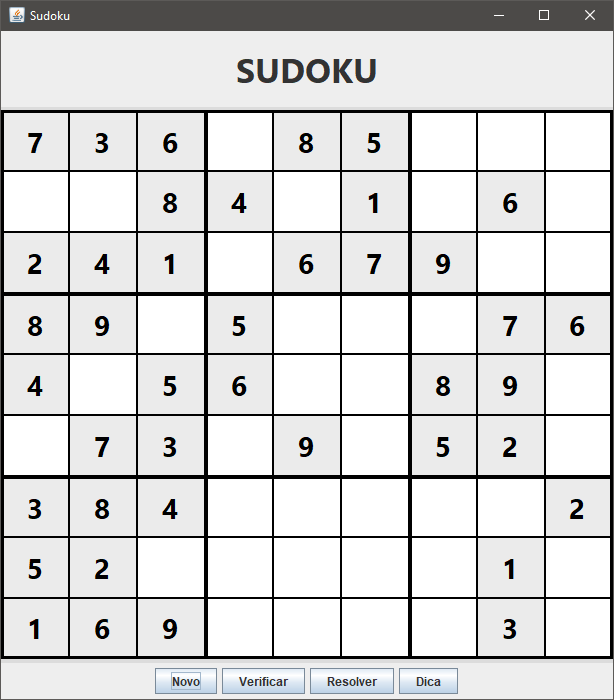

# 🧩 Sudoku Java

<p align="center">
  
</p>

<h3 align="center">
  Jogo Sudoku desenvolvido em Java utilizando Java Swing e conceitos de Programação Orientada a Objetos.
</h3>

---

# 📖 Sobre o Projeto

O **Sudoku Java** é uma aplicação desktop desenvolvida em Java que permite ao usuário jogar Sudoku através de uma interface gráfica interativa.

O projeto foi criado com o objetivo de aplicar conceitos de desenvolvimento de software, incluindo **Programação Orientada a Objetos**, criação de interfaces gráficas, manipulação de eventos e implementação de algoritmos.

A aplicação possui recursos como geração de tabuleiros, validação das jogadas do usuário e resolução automática utilizando algoritmo de busca.

---

# 🎯 Objetivo do Projeto

O principal objetivo deste projeto foi desenvolver uma aplicação completa em Java, praticando:

- Organização de código;
- Criação de interfaces gráficas;
- Separação de responsabilidades entre classes;
- Desenvolvimento de algoritmos;
- Manipulação de componentes Swing;
- Lógica de programação avançada.

---

# 🚀 Funcionalidades

## 🎮 Jogabilidade

✔ Interface gráfica para interação com o usuário;  
✔ Tabuleiro Sudoku 9x9;  
✔ Entrada de números nas células;  
✔ Bloqueio de entradas inválidas;  
✔ Controle de células preenchidas automaticamente;  
✔ Reinício do jogo.

---

## 🔎 Validação

✔ Verificação de números repetidos nas linhas;  
✔ Verificação de números repetidos nas colunas;  
✔ Verificação de números repetidos nos blocos 3x3;  
✔ Identificação de erros no preenchimento.

---

## 🧠 Solução Automática

O projeto possui um solucionador automático utilizando o algoritmo:

### Backtracking

O algoritmo realiza uma busca inteligente testando possibilidades até encontrar uma solução válida.

Funcionamento:

1. Procura uma célula vazia;
2. Testa números possíveis;
3. Verifica se o número respeita as regras do Sudoku;
4. Avança para a próxima célula;
5. Caso encontre um erro, retorna e testa outra possibilidade.

---

# 🛠️ Tecnologias Utilizadas

## Linguagem

☕ **Java**

## Interface Gráfica

🖥️ **Java Swing**

## Conceitos Aplicados

- Programação Orientada a Objetos (POO);
- Classes e objetos;
- Encapsulamento;
- Manipulação de eventos;
- Estruturas condicionais;
- Matrizes;
- Algoritmos de busca;
- Tratamento de entradas.

---

# 📂 Estrutura do Projeto
```text
Sudoku-Java
│
├── img
│ ├── Dica.PNG
│ ├── Sudoku.PNG
│ └── Verificar.PNG
│
└── src
     ├── Main.java
     ├── NumberDocument.java
     ├── Sudoku.java
     ├── SudokuCell.java
     ├── SudokuFrame.java
     ├── SudokuGenerator.java
     └──SudokuPanel.java

```
